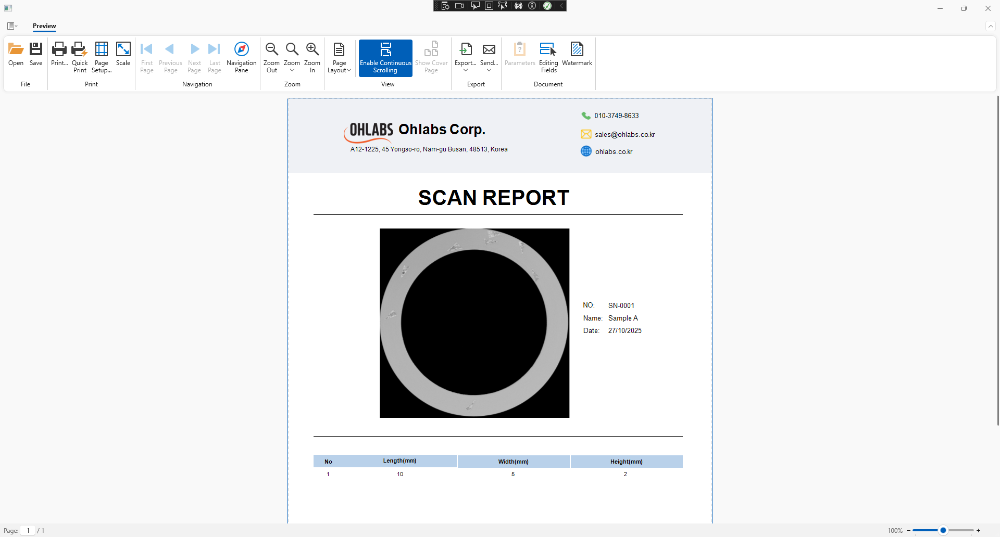

# DXApplicationReporting Project

Description
-----------

`DXApplicationReporting` is a sample project for generating reports (reporting) for the sample scanning workflow using SAM, developed for Ohlab.

Purpose
-------

- Provide a WPF sample application to display and export reports from sample scanning results.
- Integrate with SAM to process scan data and generate XtraReport files (`.cs` / `.Designer`) that can be printed or exported.

Main contents of the repository
-------------------------------

- `DXApplicationReport.sln` - The main solution for the project.
- `DXApplicationReporting/` - Contains the WPF source code, including `MainWindow.xaml` and report-related files under `Report/`.
- `Report/` - Contains `XtraReportInstance.cs` and related report design files.

Requirements and quick run
-------------------------

- Requirements: .NET SDK (a version compatible with the project, e.g. .NET 9 / .NET 8 depending on the project configuration). We recommend using Visual Studio to open and run the WPF application.
- Quick run steps:
	1. Open `DXApplicationReport.sln` in Visual Studio.
	2. Select the Debug configuration and a matching target framework (for example `net9.0-windows`).
	3. Build and Run to test the UI and reporting features.

Technical notes
---------------

- Sample reports are located in the `Report/` folder — you can edit `XtraReportInstance.Designer.cs` to customize layout.
- Executables and dependencies are generated under `bin/Debug/net9.0-windows/` after building the project.

Contact
-------

If you need support or have questions about SAM/Ohlab integration, contact the development team or open an issue in this repository.

---

_Version note._ This is a short README translation into English; if you want, I can add more detailed instructions (SAM configuration, sample data, or packaging instructions).

Screenshot
----------

Below is a preview screenshot of the generated scan report. Add the actual image file to `Screenshot.png` in the repository to make it display on GitHub.



If the image doesn't appear, place the PNG at `images/scan_report_preview.png` (create the `images/` folder if it does not exist) or open this repository in an environment that has the image stored locally.

Usage — calling ShowReport
--------------------------

This project provides a convenience method on MainWindow:

```csharp
public void ShowReport(string serial, string sampleName, Image img, DateTime date, (double length, double width, double height)[] dimensionsArray)
{
    var report = ReportService.CreateReport(serial, sampleName, img, date, dimensionsArray);
    viewer.DocumentSource = report;
}
```

Examples of how to use it from code:

- From MainWindow (already used in the constructor)
```csharp
this.ShowReport("SN-0001", "Sample A", img, DateTime.Now, defaultDims);
```