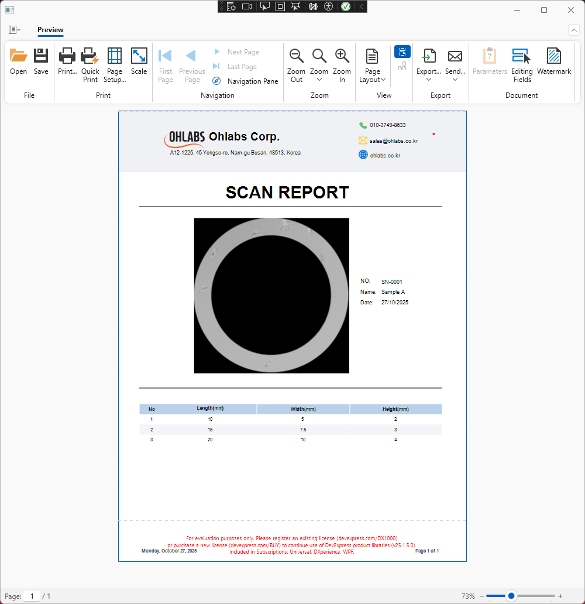

# DXApplicationReporting Project

DXApplicationReporting — a compact WPF sample that generates and previews XtraReport reports for sample scanning (SAM integration).


Description
-----------

`DXApplicationReporting` is a sample project for generating reports (reporting) for the sample scanning workflow using SAM, developed for Ohlab.

Purpose
-------

- Provide a WPF sample application to display and export reports from sample scanning results.
- Integrate with SAM to process scan data and generate XtraReport files (`.cs` / `.Designer`) that can be printed or exported.


Screenshot
----------

Below is a preview screenshot of the generated scan report. Add the actual image file to `Screenshot.png` in the repository to make it display on GitHub.



If the image doesn't appear, place the PNG at `images/scan_report_preview.png` (create the `images/` folder if it does not exist) or open this repository in an environment that has the image stored locally.

Usage — calling ShowReport
--------------------------

This project provides a convenience method on MainWindow:

```csharp
public void ShowReport(string serial, string sampleName, Image img, DateTime date, (double length, double width, double height)[] dimensionsArray)
{
    var report = ReportService.CreateReport(serial, sampleName, img, date, dimensionsArray);
    viewer.DocumentSource = report;
}
```

Examples of how to use it from code:

- From MainWindow (already used in the constructor)
```csharp
this.ShowReport("SN-0001", "Sample A", img, DateTime.Now, defaultDims);
```